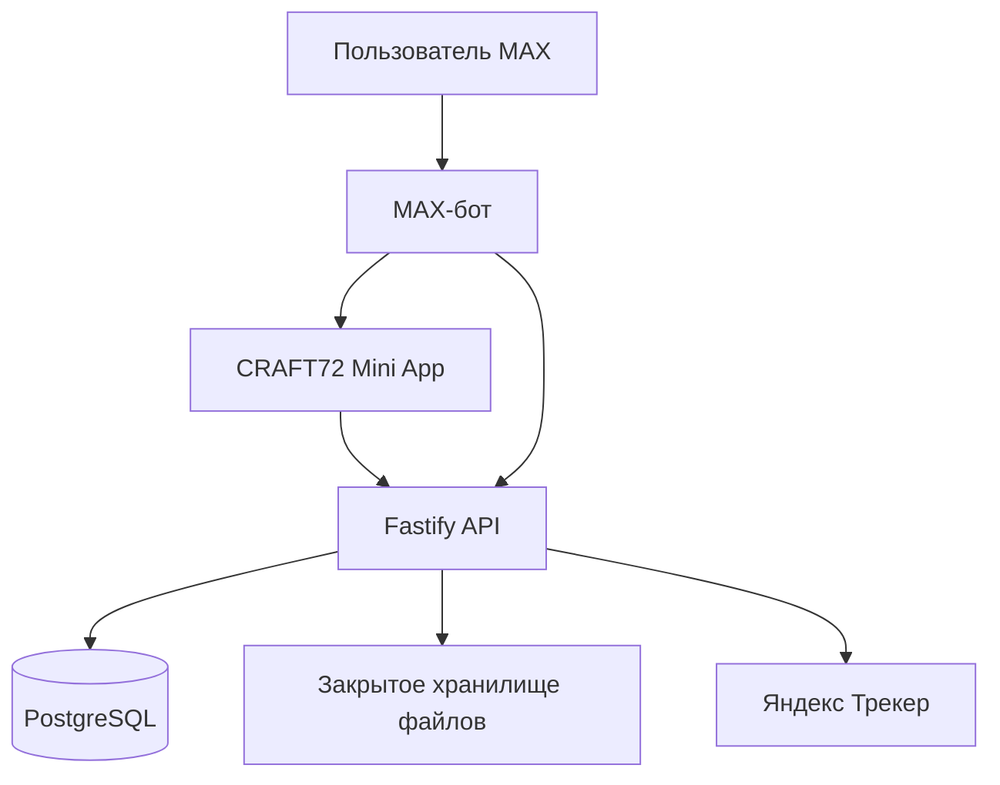

# CRAFT72 MAX Mini App — мастер-гайд для Codex

Версия: 1.0  
Дата: 15 июля 2026 года  
Целевой сервер: `109.174.15.132`, SSH-пользователь: `mun`

## 0. Главная продуктовая рекомендация

Реализовать не «только чат-бот» и не «только сайт внутри MAX», а единую связку:

- **тонкий MAX-бот** — точка входа, команда `/start`, кнопка открытия приложения, быстрый FAQ, получение сообщений и передача человеку;
- **MAX Mini App** — основной пользовательский интерфейс: выбор услуги, бриф нового проекта, каталог кейсов, отправка ТЗ и подтверждение заявки;
- **общий backend** — проверка MAX-пользователя, хранение черновиков, обработка заявок, файлов, Webhook и интеграция с Яндекс Трекером;
- **PostgreSQL** — состояния, заявки, защита от дублей и очередь интеграционных операций;
- **Яндекс Трекер** — рабочая система сотрудников CRAFT72: `CRM`, `PART`, `DOCS`.

Мини-приложение в MAX привязывается к прошедшему модерацию боту. Поэтому бот сохраняется как оболочка и канал входа, а сложный интерфейс переносится в Mini App.

## 1. Критическое действие перед началом

MAX-токен, ранее опубликованный в переписке, считать скомпрометированным.

Codex запрещено:

- проверять старый токен через API;
- использовать его даже временно;
- вставлять его в код, команды, `.env`, тесты, логи или документацию;
- повторять его в отчётах.

До подключения production необходимо отозвать/обновить токен в MAX для партнёров. Новый токен пользователь вводит **не в чат**, а непосредственно на сервере в закрытый secret-файл.

Во всём проекте использовать только плейсхолдер:

```dotenv
MAX_BOT_TOKEN=<NEW_ROTATED_TOKEN>
```

## 2. Цель MVP

MVP должен превращать посетителя в структурированную заявку, с которой менеджер может начать работу без повторного опроса.

В MVP входят:

1. запуск Mini App из MAX-бота;
2. проверка подлинности MAX-сессии;
3. главное меню;
4. подбор услуги;
5. многошаговый бриф нового проекта;
6. каталог и подбор релевантных кейсов CRAFT72;
7. приём текстового ТЗ, файлов и ссылок;
8. получение подтверждённого номера через MAX;
9. экран проверки и подтверждения заявки;
10. создание связанных сущностей в `PART`, `CRM`, `DOCS`;
11. номер обращения и экран успешной отправки;
12. лёгкий бот для открытия Mini App и связи с менеджером;
13. защита от повторной обработки Webhook и повторного создания заявок;
14. журналирование, health-check, тесты и rollback.

Не включать в первый релиз:

- полноценный кабинет действующего клиента;
- двустороннюю синхронизацию статусов проектов;
- AI-консультанта;
- автоматический расчёт цены;
- обещание сроков проектирования или экспертизы;
- HR и поставщиков;
- массовые, рекламные и инициативные сервисные рассылки;
- юридически значимое согласование проектных решений.

## 3. Пользовательские роли

В MVP поддержать внешнего заказчика:

- девелопер или строительный холдинг;
- частный/корпоративный инвестор;
- государственный или муниципальный заказчик;
- собственник объекта;
- генеральный подрядчик;
- другое.

Сотрудник CRAFT72 работает в Яндекс Трекере. Админ-панель Mini App в MVP не нужна.

## 4. Архитектура



### 4.1 Рекомендуемый стек

Монорепозиторий TypeScript:

```text
craft72-max-app/
  apps/
    miniapp/        # React + Vite + MAX UI
    api/            # Fastify + MAX webhook + REST API
    worker/         # durable outbox worker, допускается один runtime с api в MVP
  packages/
    contracts/      # Zod-схемы и общие типы
    config/         # типизированная конфигурация
  data/
    cases/          # курируемый каталог проектов
  docs/
    architecture.md
    deployment.md
    rollback.md
    operations.md
  .env.example
  package.json
  pnpm-lock.yaml
  README.md
```

Использовать:

- Node.js LTS, совместимый с актуальными библиотеками MAX;
- TypeScript в строгом режиме;
- React + Vite;
- `@maxhub/max-ui` для нативно выглядящих компонентов;
- официальный MAX Bridge через `https://st.max.ru/js/max-web-app.js`;
- Fastify;
- PostgreSQL;
- Drizzle ORM или другой типизированный migration-first ORM;
- Zod для входных данных и env;
- Pino с обязательной redaction;
- Vitest;
- Playwright для browser E2E;
- `pnpm` и зафиксированный lock-файл.

Redis/BullMQ не добавлять в MVP без измеренной необходимости. Durable inbox/outbox реализовать в PostgreSQL.

### 4.2 Почему не Next.js в MVP

Mini App является компактным клиентским интерфейсом. Статическая сборка React/Vite проще, потребляет меньше памяти и независимо разворачивается через Nginx. Fastify отдельно принимает Webhook и обрабатывает интеграции. Если на сервере уже стандартизирован другой стек, Codex сначала сообщает об этом, но не меняет архитектуру без причины.

## 5. UX Mini App

### 5.1 Общие требования

- mobile-first;
- корректная работа на iOS, Android, desktop и web MAX;
- светлая и тёмная тема;
- учитывать `window.WebApp.getViewportSize()`;
- использовать MAX UI, не имитировать интерфейс стороннего мессенджера;
- минимальная ширина поддержки — 320 px;
- большие зоны нажатия, доступные подписи и видимый focus;
- все ключевые действия доступны без горизонтальной прокрутки;
- черновик сохраняется после каждого шага;
- при незавершённом брифе включать `window.WebApp.enableClosingConfirmation()`;
- показывать состояние загрузки, ошибки и возможность повтора;
- не терять введённые данные при обновлении страницы или перезапуске backend.

### 5.2 Экраны MVP

#### Экран 1. Главная

Основные действия:

- `Обсудить новый проект` — primary;
- `Подобрать услугу`;
- `Посмотреть проекты`;
- `Отправить ТЗ`;
- `Связаться с менеджером`.

Дополнительно: краткое позиционирование CRAFT72 и ссылка на политику обработки данных.

#### Экран 2. Подбор услуги

Короткая диагностика:

- тип объекта;
- текущая стадия;
- требуемый результат;
- нужна ли экспертиза;
- является ли объект ОКН;
- один объект или портфель.

Результат — 1–3 подходящих направления с объяснением и CTA `Обсудить проект`.

Не генерировать цену и точный срок.

#### Экран 3. Многошаговый бриф

Обязательные шаги:

1. роль пользователя;
2. имя и организация;
3. ИНН — опционально для части ролей;
4. тип объекта;
5. город/регион;
6. один объект или портфель, количество;
7. ориентировочная площадь;
8. текущая стадия;
9. необходимые услуги;
10. необходимость экспертизы/ОКН;
11. желаемый срок начала;
12. краткое описание;
13. файлы и ссылки;
14. телефон через `window.WebApp.requestContact()`;
15. e-mail;
16. согласие на обработку данных;
17. итоговое резюме.

Для площади, срока и части параметров предусмотреть `Пока не знаю`.

На каждом шаге:

- `Назад`;
- `Сохранить и выйти`;
- визуальный прогресс;
- понятная валидация без очистки формы.

#### Экран 4. Проекты

Фильтры:

- тип объекта;
- услуга;
- регион/город;
- масштаб;
- новое строительство/реконструкция/ОКН.

Карточка:

- изображение;
- название;
- город;
- площадь, если опубликована;
- выполненные услуги;
- статус;
- ссылка на страницу `craft72.ru`;
- `Обсудить похожий проект`.

Подбор детерминированный. Не использовать LLM и runtime-скрейпинг сайта.

#### Экран 5. ТЗ и файлы

- текстовое описание;
- drag/drop в web и системный выбор на мобильном;
- список принятых, загружаемых и отклонённых файлов;
- поле для ссылки на облако;
- предупреждение о конфиденциальных данных;
- большие BIM/CAD-файлы — через защищённую ссылку.

#### Экран 6. Проверка заявки

Показать все данные по разделам, дать редактирование каждого раздела и только затем кнопку `Отправить заявку`.

#### Экран 7. Успех

Показать:

- неизменяемый `submission_id`;
- подтверждение приёма;
- список полученных материалов;
- подобранные кейсы;
- кнопки `Добавить материалы`, `Открыть чат`, `На главную`.

Не обещать конкретный SLA, пока он письменно не утверждён CRAFT72.

## 6. Функции тонкого MAX-бота

Бот не дублирует все формы Mini App.

Обязательные функции:

- обработать `bot_started` и `/start`;
- показать краткое приветствие;
- дать кнопку типа `open_app` — `Открыть CRAFT72`;
- дать кнопки `Отправить ТЗ`, `Проекты`, `Связаться с менеджером`, ведущие в нужный раздел Mini App через `startapp` payload;
- принять свободный текст и предложить открыть подходящий раздел;
- сохранить сообщение как обращение, если пользователь не хочет открывать Mini App;
- корректно обработать `bot_stopped`;
- не делать рекламные или массовые рассылки.

Диплинки:

```text
https://max.ru/<BOT_NAME>?startapp=new_project
https://max.ru/<BOT_NAME>?startapp=services
https://max.ru/<BOT_NAME>?startapp=portfolio
https://max.ru/<BOT_NAME>?startapp=upload_brief
https://max.ru/<BOT_NAME>?startapp=source_<campaign>
```

Backend валидирует допустимые `start_param`; клиент не доверяет ему как готовой команде.

## 7. Аутентификация MAX Mini App

### 7.1 Обязательный поток

1. Mini App получает `window.WebApp.initData`.
2. Клиент передаёт строку на backend.
3. Backend валидирует подпись строго по актуальной документации MAX.
4. Backend проверяет `auth_date`; рекомендуемое окно — не более 1 часа.
5. После успешной проверки backend создаёт короткоживущую серверную сессию.
6. Все заявки и файлы связываются с проверенным MAX `user.id`.

`initDataUnsafe` разрешено использовать только для предварительного отображения, но **не для доверенной идентификации**.

### 7.2 Контакт

Получать номер через:

```javascript
window.WebApp.requestContact()
```

Backend проверяет hash по официальному алгоритму MAX. Отказ пользователя не должен ломать форму: разрешить ручной ввод, помечая номер как `unverified`.

Нельзя использовать полученный контакт за пределами взаимодействия с текущим Mini App/ботом.

## 8. Модель данных

Минимальные таблицы:

### `max_users`

- `id` UUID;
- `max_user_id` bigint unique;
- `first_name`, `last_name`;
- `username` nullable;
- `language_code`;
- `created_at`, `updated_at`.

### `sessions`

- `id` UUID;
- `max_user_id` FK;
- `expires_at`;
- `revoked_at`;
- `created_at`.

### `lead_drafts`

- `id` UUID;
- `max_user_id` FK;
- `current_step`;
- `payload` JSONB;
- `source`;
- `updated_at`;
- `expires_at`.

### `submissions`

- `id` UUID internal;
- `submission_id` string unique, человекочитаемый;
- `max_user_id` FK;
- нормализованные поля брифа;
- `phone`, `phone_verified`;
- `email`;
- `consent_version`, `consented_at`;
- `source`;
- `status`;
- `tracker_crm_key`, `tracker_part_key`, `tracker_docs_key` nullable;
- `created_at`, `updated_at`.

### `documents`

- `id` UUID;
- `submission_id` FK;
- `original_name`;
- `storage_key`;
- `mime_type`;
- `size_bytes`;
- `sha256`;
- `scan_status`;
- `created_at`, `deleted_at`.

### `webhook_inbox`

- `event_key` unique;
- `event_type`;
- `payload` JSONB;
- `status`;
- `attempts`;
- `received_at`, `processed_at`.

### `integration_outbox`

- `id` UUID;
- `operation`;
- `idempotency_key` unique;
- `payload` JSONB;
- `status`;
- `attempts`;
- `next_attempt_at`;
- `last_error_code`;
- timestamps.

### `case_catalog`

Можно хранить в версионируемом JSON/YAML в MVP. Поля: title, url, image, city, region, categories, services, area, status, tags, published.

## 9. API backend

Минимальные endpoint:

```text
POST /api/auth/max
POST /api/contact/verify
GET  /api/catalog/cases
POST /api/leads/draft
GET  /api/leads/draft
POST /api/uploads/init
POST /api/uploads/:id/complete
POST /api/submissions
GET  /api/submissions/:submissionId
POST /webhooks/max
GET  /health/live
GET  /health/ready
```

Требования:

- Zod-валидация каждого входа и выхода;
- rate limit по IP и MAX user ID;
- CORS только для домена Mini App;
- request ID/correlation ID;
- запрет выдачи чужой заявки;
- тела ошибок без stack trace и секретов;
- `/health/*` не возвращают конфигурацию, токены и PII.

## 10. MAX Webhook

Использовать только:

```text
https://platform-api2.max.ru
```

Production Webhook:

- только HTTPS;
- публичный порт 443;
- доверенный сертификат с совпадающим доменом;
- `secret` при создании подписки;
- проверка `X-Max-Bot-Api-Secret` constant-time;
- подписка только на нужные события: `bot_started`, `bot_stopped`, `message_created`, `message_callback`;
- durable-запись события в `webhook_inbox` до ответа `200`;
- внешние API не вызываются синхронно до ответа Webhook;
- повторная доставка одного события не создаёт дублей;
- события одного чата обрабатываются последовательно;
- `429`, `503` и timeout повторяются с exponential backoff и jitter;
- остальные `4xx` автоматически не повторяются;
- неизвестное корректное событие журналируется и получает `200`, чтобы не создавать retry storm.

Цель: p95 ответа Webhook менее 500 мс при доступной БД.

## 11. Файлы

Несмотря на большие лимиты MAX, для MVP установить собственный лимит, например 50 МБ на файл. Значение конфигурируемое и утверждается после проверки диска.

Разрешить на первом этапе:

- PDF;
- DOC/DOCX;
- XLS/XLSX;
- TXT;
- JPG/PNG;
- DWG/DXF/IFC как неисполняемые бинарные файлы;
- ZIP только при включённой антивирусной проверке и защите от zip bomb.

Требования:

- потоковая загрузка, не загружать файл целиком в RAM;
- проверка расширения, MIME и сигнатуры;
- внутреннее имя UUID, исходное имя отдельно;
- защита от path traversal;
- SHA-256;
- карантин;
- антивирусная проверка;
- файлы никогда не исполняются и не передаются в shell;
- закрытое хранилище;
- временные подписанные ссылки для сотрудников;
- срок хранения и удаление по политике CRAFT72;
- произвольные URL пользователя автоматически не скачивать из-за SSRF; сохранять ссылку либо применять строгий allowlist.

Для больших BIM/CAD-моделей предложить защищённую внешнюю ссылку.

## 12. Интеграция с Яндекс Трекером

### 12.1 Авторизация

Использовать API v3 и один из официальных способов:

- OAuth: `Authorization: OAuth <token>`;
- IAM для поддерживаемой Yandex Cloud Organization.

Обязателен `X-Org-ID` или `X-Cloud-Org-ID`.

Секреты Трекера не передавать в браузер и не хранить в репозитории.

### 12.2 Перед изменениями

Codex сначала через read-only API выясняет:

- доступность очередей `CRM`, `PART`, `DOCS`;
- реальные ID локальных и глобальных полей;
- типы полей;
- обязательные поля;
- существующие правила связей;
- тестовую очередь или dry-run режим.

Не менять очереди, поля, workflows и автоматизации Трекера без отдельного согласования.

Интеграционные тесты запрещено выполнять на production-очередях.

### 12.3 Маппинг

| Сущность | Очередь | Правило |
|---|---|---|
| Организация | `PART` | точный поиск по нормализованному ИНН |
| Лид | `CRM` | одна задача на один `submission_id` |
| Материалы | `DOCS` | создавать при наличии файла или ссылки |

Правила:

- не объединять компании fuzzy-поиском;
- без ИНН создавать запись с флагом ручной проверки дубля;
- в CRM сохранять источник `MAX`, бриф, контакты, `submission_id`, MAX ID и ссылку на `PART`;
- в DOCS сохранять метаданные материалов и связи с `CRM`/`PART`;
- ключи созданных задач записывать в локальную БД;
- операции `upsert_partner`, `create_crm`, `create_docs` выполнять через transactional outbox;
- каждая операция имеет уникальный idempotency key;
- при недоступности Трекера заявка остаётся сохранённой и синхронизируется позже;
- ошибка синхронизации видима администратору без потери лида.

## 13. Безопасность и персональные данные

- перед формой показать политику обработки данных;
- сохранить версию согласия и timestamp;
- минимизировать собираемые данные;
- не показывать данные другой заявки;
- запретить индексацию Mini App поисковиками;
- применить CSP, `X-Content-Type-Options`, `Referrer-Policy`, frame policy с учётом требований MAX;
- CSRF-защита для cookie-сессий либо использовать короткоживущий bearer session token;
- проверять MAX initData только на backend;
- токены, телефон, e-mail, ТЗ и ссылки на файлы редактировать в логах;
- `.env` — права `600`, вне Git;
- отдельные development и production secrets;
- отдельный непривилегированный процесс;
- параметризованные SQL-запросы;
- retention policy и процедура удаления данных;
- резервные копии БД и тест восстановления.

До письменной проверки договора с MAX не реализовывать рекламные, массовые и инициативные сервисные сообщения. MVP отвечает на действие пользователя и создаёт обращение в Трекере.

## 14. Нужен ли сервер

Да. Сервер нужен для:

- HTTPS-размещения Mini App;
- backend API;
- проверки `initData` и контакта;
- MAX Webhook;
- базы данных;
- очереди интеграций;
- безопасной работы с файлами;
- Яндекс Трекера;
- логов, health-check и мониторинга.

Сервер `109.174.15.132` подходит, если после preflight подтверждены:

- доступная RAM и диск;
- свободный loopback-порт;
- возможность добавить отдельный Nginx server block;
- PostgreSQL или возможность безопасно поднять отдельную БД;
- исходящие HTTPS-соединения с MAX и Яндексом;
- доступный публичный порт 443;
- отдельный поддомен, например `maxbot.craft72.ru`, направленный A-записью на сервер;
- доверенный TLS-сертификат.

IP без домена и сертификата недостаточен для production Webhook.

## 15. Жёсткая политика работы Codex на сервере

На сервере много проектов. Нельзя изменять или перезапускать что-либо вне нового приложения.

### 15.1 Сначала только read-only preflight

Подключение:

```bash
ssh mun@109.174.15.132
```

Разрешённые проверки:

```bash
whoami
hostname
pwd
uname -a
df -h
free -h
ss -lnt
ps aux --sort=-%mem | head -30
pm2 ls
docker ps --format 'table {{.Names}}\t{{.Image}}\t{{.Ports}}\t{{.Status}}'
nginx -t
node --version
npm --version
```

Не выводить в чат:

- `env`;
- содержимое `.env`;
- `pm2 jlist`;
- `docker inspect`;
- полный `nginx -T`;
- shell history;
- токены, пароли и приватные ключи.

После preflight Codex обязан показать:

1. найденную инфраструктуру;
2. свободный порт;
3. новый каталог;
4. способ запуска;
5. отдельную схему БД;
6. изменения Nginx;
7. риски;
8. точный rollback.

До подтверждения не создавать каталог, не ставить пакеты и не менять Nginx, PM2, Docker, firewall, БД или DNS.

### 15.2 Изоляция

Рекомендуемые уникальные ресурсы, если они свободны:

| Ресурс | Значение |
|---|---|
| Каталог | `/home/mun/apps/craft72-max-app` |
| Процесс API | `craft72-max-api` |
| Процесс worker | `craft72-max-worker` |
| Backend bind | только `127.0.0.1:<FREE_PORT>` |
| Домен | `maxbot.craft72.ru` |
| База | `craft72_max_app` |
| Роль БД | отдельная, только для этой БД |
| Nginx | отдельный конфигурационный файл |
| Логи | отдельный каталог с ротацией |
| Secrets | отдельный файл с правами `600` |

Если ресурс занят — остановиться, не переиспользовать его.

### 15.3 Запрещённые действия

- `rm -rf` по общим каталогам;
- `git reset --hard`, `git clean -fd` в существующих проектах;
- `docker system prune`;
- `docker compose down` без точного project name;
- `pm2 kill`;
- `pm2 delete/restart/reload all`;
- `pm2 save` без отдельного согласования;
- `apt upgrade`, глобальное обновление Node/npm;
- `npm audit fix --force`;
- изменение firewall;
- reboot;
- изменение существующих Nginx server blocks;
- использование существующей БД/роли/volume без подтверждения;
- чтение секретов других приложений.

### 15.4 Выбор deployment-механизма

Использовать тот механизм, который уже принят на сервере:

- если PM2 — отдельный ecosystem-файл и рестарт только новых процессов;
- если systemd — отдельные units;
- если Docker Compose — уникальный project name `craft72-max-app`, сеть и volumes;
- не смешивать механизмы для одного сервиса;
- не устанавливать Docker только ради этого проекта без отдельного решения.

## 16. Nginx, DNS и TLS

1. Создать A-запись нового поддомена на `109.174.15.132`.
2. Дождаться DNS propagation.
3. Поднять backend только на loopback.
4. Собрать Mini App в статические файлы.
5. Создать отдельный Nginx server block.
6. Проверить `nginx -t`.
7. Выпустить доверенный сертификат.
8. Выполнить только `reload`, не `restart`.
9. Проверить публичные `/health/live` и Mini App.
10. Только затем подключать Mini App и Webhook в MAX.

Не менять конфигурацию `craft72.ru` и других доменов.

## 17. Переменные окружения

`.env.example` содержит только плейсхолдеры:

```dotenv
NODE_ENV=production
API_HOST=127.0.0.1
API_PORT=<FREE_PORT>
PUBLIC_BASE_URL=https://maxbot.craft72.ru

MAX_API_BASE_URL=https://platform-api2.max.ru
MAX_BOT_TOKEN=<NEW_ROTATED_TOKEN>
MAX_WEBHOOK_SECRET=<RANDOM_SECRET>
MAX_INIT_DATA_MAX_AGE_SECONDS=3600

DATABASE_URL=postgresql://<DEDICATED_USER>:<PASSWORD>@127.0.0.1:5432/craft72_max_app

TRACKER_API_BASE_URL=https://api.tracker.yandex.net/v3
TRACKER_AUTH_TYPE=oauth
TRACKER_TOKEN=<SECRET>
TRACKER_ORG_HEADER=X-Org-ID
TRACKER_ORG_ID=<ORG_ID>
TRACKER_QUEUE_CRM=CRM
TRACKER_QUEUE_PART=PART
TRACKER_QUEUE_DOCS=DOCS
TRACKER_DRY_RUN=true

UPLOAD_MAX_BYTES=52428800
UPLOAD_STORAGE_PATH=<DEDICATED_PRIVATE_PATH>
LOG_LEVEL=info
```

Реальный `.env`:

- создаётся непосредственно на сервере;
- не передаётся через чат;
- не входит в Git;
- имеет права `600`;
- не читается и не печатается в отчётах.

## 18. Этапы реализации для Codex

### Этап 0. Инвентаризация

Только read-only server preflight и отчёт. Никаких изменений.

### Этап 1. Репозиторий и контракты

- создать изолированный проект;
- настроить workspace;
- строгий TypeScript, lint, format, tests;
- `.env.example`;
- Zod-схемы;
- миграции;
- CI без production secrets.

### Этап 2. UI Mini App на моках

- подключить MAX Bridge и MAX UI;
- реализовать темы, viewport и навигацию;
- главная;
- бриф;
- каталог;
- загрузка;
- резюме;
- success;
- mock API;
- responsive E2E.

### Этап 3. Backend и MAX auth

- валидация `initData`;
- серверные сессии;
- `requestContact` verification;
- draft API;
- submissions;
- RBAC на уровне владельца заявки;
- health endpoints.

### Этап 4. Бот и Webhook

- `/start`/`bot_started`;
- open_app buttons;
- deeplink routing;
- inbox/outbox;
- idempotency;
- retry;
- mock MAX API tests.

### Этап 5. Файлы

- streaming upload;
- ограничения и сигнатуры;
- карантин;
- антивирус;
- storage abstraction;
- signed links;
- security tests.

### Этап 6. Яндекс Трекер

- read-only discovery полей;
- согласованный mapping;
- dry-run;
- `PART` → `CRM` → `DOCS` через outbox;
- retries и дедупликация;
- тестовая очередь;
- запрет E2E на production до отдельного подтверждения.

### Этап 7. Staging

- отдельные secrets;
- тестовый поддомен либо защищённый режим;
- полный E2E;
- мобильные MAX-клиенты;
- accessibility;
- отказ MAX/Tracker/БД;
- нагрузочный smoke test.

### Этап 8. Production

- backup;
- build из lock-файла;
- миграции;
- запуск только новых процессов;
- loopback health;
- Nginx config test;
- HTTPS health;
- подключение Mini App;
- регистрация Webhook;
- test submission;
- проверка Tracker;
- мониторинг.

## 19. Тесты

### Unit

- валидация MAX initData;
- verification contact hash;
- ИНН и e-mail;
- шаги брифа;
- назад/сохранить/возобновить;
- ранжирование кейсов;
- mapping Tracker;
- idempotency keys;
- retry policy;
- redaction секретов и PII.

### Integration

- Mini App auth → session;
- draft → submission;
- webhook → inbox → outbox;
- конкурентный дубль события;
- рестарт worker;
- MAX API: 401/429/503/timeout;
- Tracker: частичный успех и восстановление;
- файл: limit, MIME mismatch, path traversal, duplicate hash, virus;
- migrations up/down на копии.

### E2E

- запуск из кнопки бота;
- полный бриф;
- запрос контакта и ручной fallback;
- редактирование резюме;
- сохранение/возобновление;
- подбор кейсов;
- загрузка файлов;
- повторное нажатие submit;
- недоступность Tracker с последующей синхронизацией;
- проверка на iOS/Android/web/desktop MAX.

## 20. Definition of Done

MVP готов, если:

- Mini App открывается из бота и по диплинку;
- backend отклоняет поддельный/просроченный initData;
- черновик переживает закрытие приложения и рестарт backend;
- пользователь видит и подтверждает полное резюме;
- повторный submit не создаёт вторую заявку;
- десять одинаковых Webhook создают одну бизнес-операцию;
- заявка сохраняется даже при недоступном Трекере;
- после восстановления создаются ровно один `PART`, один `CRM` и при наличии материалов один `DOCS`;
- файлы закрыты от посторонних;
- секретов нет в Git, логах и build artifacts;
- все production-процессы, порты, БД и Nginx-конфиг изолированы;
- проверен rollback;
- существующие проекты сервера не изменены и не перезапускались;
- есть `README`, deployment, rollback и operations runbook;
- выполнены smoke и E2E на реальном MAX-клиенте;
- используется только новый перевыпущенный MAX-токен.

## 21. Rollback

До production Codex обязан подготовить:

- предыдущий release;
- отдельный backup БД;
- способ переключить `current` symlink либо версию контейнера;
- точный рестарт только `craft72-max-api`/`craft72-max-worker`;
- backup только нового Nginx-файла;
- отключение MAX webhook без затрагивания других приложений;
- проверку `/health/live`, `/health/ready` и тестового запуска Mini App после отката.

Нельзя считать rollback готовым только потому, что команды записаны: его нужно проверить на staging или копии.

## 22. Когда Codex обязан остановиться

Остановиться и запросить решение, если:

- опубликованный старый токен не перевыпущен перед production;
- каталог или имя процесса заняты;
- свободный порт не подтверждён;
- непонятно, какой Nginx-конфиг активен;
- изменение затрагивает существующий сайт/процесс/БД;
- нет отдельной БД или безопасного namespace;
- не хватает RAM/диска;
- нужен firewall/reboot/глобальное обновление;
- нет DNS и доверенного TLS;
- нет политики обработки данных;
- неизвестны поля Трекера и нет dry-run/test queue;
- нет backup или проверяемого rollback;
- в существующем репозитории найдены незакоммиченные изменения.

## 23. Что требуется от владельца проекта

До production предоставить не через чат, а безопасным способом:

1. новый MAX-токен;
2. возможность добавить Mini App к боту;
3. DNS-доступ для отдельного поддомена;
4. URL политики обработки персональных данных;
5. контакт поддержки;
6. OAuth/IAM-доступ Яндекс Трекера с минимальными правами;
7. ID организации Трекера;
8. подтверждение полей и связей `CRM`, `PART`, `DOCS`;
9. тестовую очередь или разрешение на dry-run;
10. правила назначения ответственного;
11. утверждённый текст согласия;
12. утверждённый каталог кейсов;
13. допустимые форматы, объём и срок хранения файлов;
14. утверждённый SLA либо решение не показывать срок.

## 24. Официальные источники

- MAX Mini Apps: https://dev.max.ru/docs/webapps/introduction
- MAX Bridge: https://dev.max.ru/docs/webapps/bridge
- Валидация initData: https://dev.max.ru/docs/webapps/validation
- MAX UI: https://dev.max.ru/ui
- MAX Bot API: https://dev.max.ru/docs-api
- MAX Webhook: https://dev.max.ru/docs-api/methods/POST/subscriptions
- Настройка бота: https://dev.max.ru/docs/chatbots/bots-coding/prepare
- Требования MAX: https://dev.max.ru/docs/legal/requirements
- Доступ к API Яндекс Трекера: https://yandex.ru/support/tracker/ru/api-ref/access
- Создание задачи Трекера: https://yandex.ru/support/tracker/ru/api-ref/issues/create-issue
- CRAFT72 — о компании: https://craft72.ru/about
- CRAFT72 — проекты: https://craft72.ru/
- CRAFT72 — портфельное проектирование: https://craft72.ru/portfolioproject

